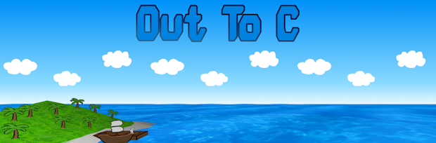

# Out to C

an upcoming YSWS where you sail out to sea on the hunt for treasure, by coding C. 



check it out! [https://out-to-c.dino.icu/](https://out-to-c.dino.icu/)

---

this repo is currently just the homepage. the WIP backend is at [out-to-c-server](https://github.com/ingobeans/out-to-c-server)

built with plain html/css + ThreeJS for the 3D background. for the next version, I will probably replace ThreeJS with Rust WebGL since I'm pretty sure it loads faster.

## Building

all js dependencies can be bundled in to a single minified js file. 

you'll need npm first, then install threejs and esbuild with:
```bash
npm install three esbuild
```

then build the minified file using:
```bash
npx esbuild --bundle main.js --format=esm --minify > min.js
```
